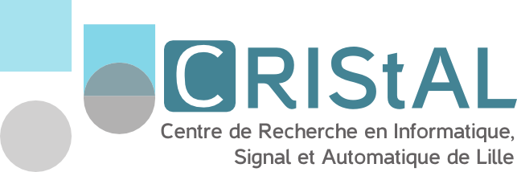

I am currently a postdoctoral researcher at [CRIStAL](https://www.cristal.univ-lille.fr/) in the [SigMA](https://www.cristal.univ-lille.fr/?rubrique27&eid=30) team in Lille, working with [Patrick Bas](http://patrickbas.ec-lille.fr/).

Before that, I was a PhD student at [Binghamton University](https://www.binghamton.edu/), where I worked in the [DDE](http://dde.binghamton.edu/butora/index.php) team, under the supervision of [Jessica Fridrich](http://www.ws.binghamton.edu/fridrich/).

## Research interests

Media forensics, steganography, steganalysis, generated content detection, watermarking, statistical image modelling, reliable deep learning

  

  

